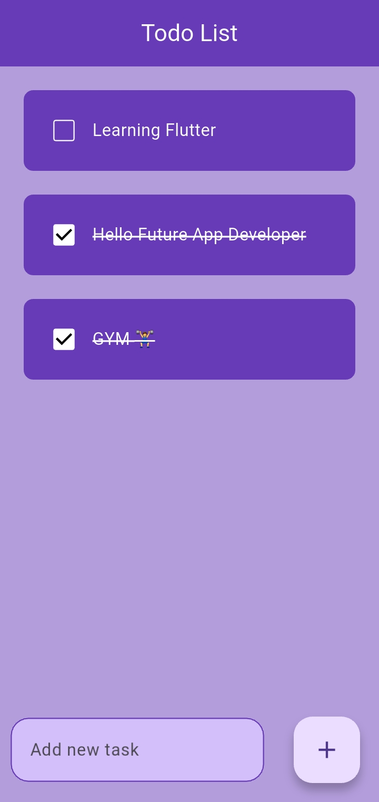
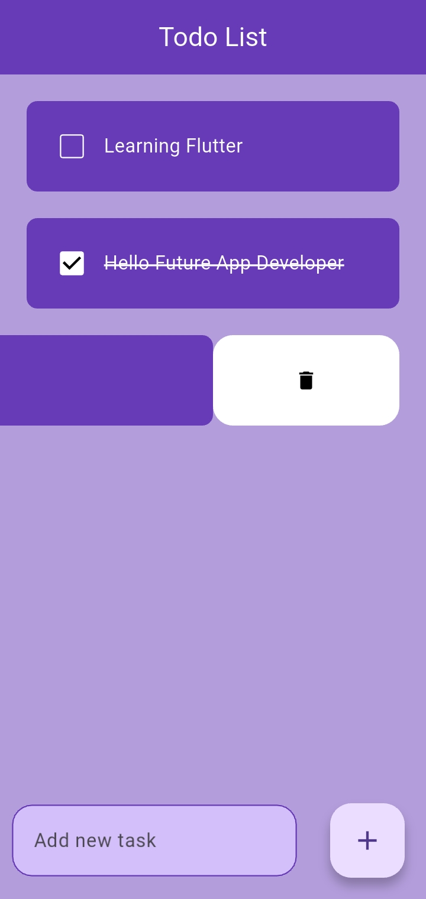

# 📝 Flutter Todo App (With Hive Storage)

A simple and clean Todo List application built using Flutter.

This version uses Hive local database to permanently store tasks.
Now, tasks will remain saved even after closing or restarting the app.

---

## 🚀 Features

- ➕ Add new tasks
- ✅ Mark tasks as completed
- 🗑 Delete tasks with slide action
- ✏️ Strike-through effect for completed tasks
- 💾 Permanent local storage using Hive
- 🎨 Simple and clean UI

---

## 🛠 Technologies Used

- Flutter
- Dart
- Hive (Local Database)
- flutter_slidable package

---

## 💾 How Data is Stored

This app uses Hive local database.

- Tasks are saved inside a Hive box.
- Data is stored in the device's internal storage.
- Data will remain saved even after:
  - Closing the app
  - Restarting the device
- Data will be removed only if:
  - The app is uninstalled
  - App data is cleared manually

---

## 📂 Project Structure

```
lib/
│
├── main.dart
├── home_screen.dart
├── database/
│   └── database.dart
└── utils/
    └── todo_list.dart
```


## 📱 Screenshots

### Home Screen


### Delete Task



---

## ▶️ How to Run This Project

### 1️⃣ Clone the repository

```bash
git clone https://github.com/Faisal-Haroon/flutter-todo-app.git
```

### 2️⃣ Navigate into the project folder

```bash
cd flutter-todo-app
```

### 3️⃣ Install dependencies

```bash
flutter pub get
```

### 4️⃣ Run the app

```bash
flutter run
```

Make sure:
- Flutter is installed properly
- An emulator is running OR a physical device is connected

---

## 📌 Learning Purpose

This project was built to practice:

- StatefulWidget
- ListView.builder
- Custom Widgets
- Local Storage with Hive
- Basic CRUD operations

---

## 📈 Future Improvements

- Edit task feature
- Add task categories
- Improve UI design
- Add dark mode

---

## 👨‍💻 Author

Faisal Haroon  
BS Software Engineering Student

---

⭐ If you like this project, consider giving it a star!